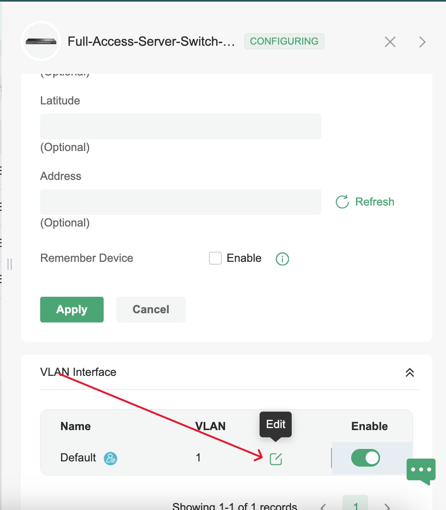

# 🌐 How to Assign a Gateway IP on an Omada Core Switch (via Omada Controller)

Follow these steps to assign a **Static IP** and **Gateway IP** to your core switch using the **Omada Controller interface**:

---

## 🧭 Step-by-Step Instructions

1. **Open the Omada Controller** interface in your browser.
- From the **Devices** list, select your **Core Switch**.
- Navigate to the **Configuration** tab.
- Go to the **VLAN** section.

5. Under the list of VLANs, locate the **Default VLAN (usually VLAN 1)**.
6. Click **Edit** next to the Default VLAN.
7. In the settings:
   - Choose **Static IP**.
   - Enter the desired **IP Address** for the switch.
   - Enter the corresponding **Gateway IP Address** (usually your router/firewall).

8. Click **Apply** or **Save** to confirm and commit the changes.

![Alt text](images/Confirmed.png

---

## ✅ Notes

- Make sure the gateway IP is **within the same subnet** as the static IP assigned to the switch.
- This setup is necessary for **Layer 3 communication** and for the switch to route traffic outside its VLAN/subnet.
- If you're managing VLANs, ensure routing is configured properly for inter-VLAN communication.