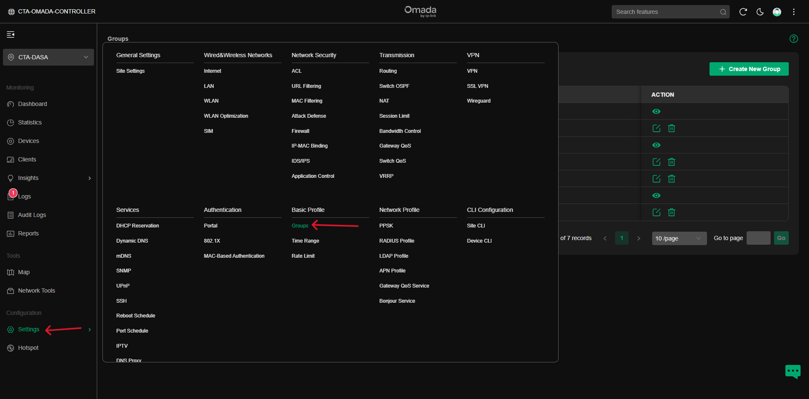
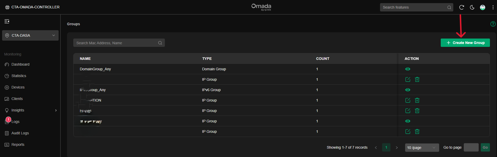
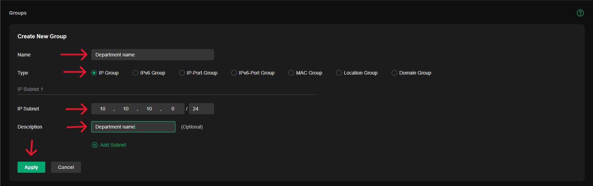
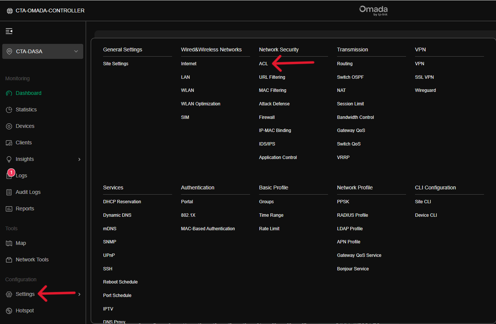
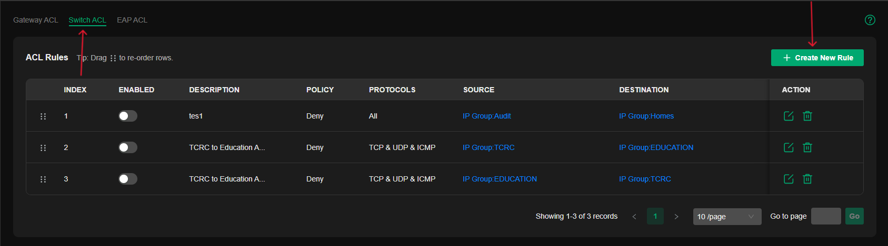
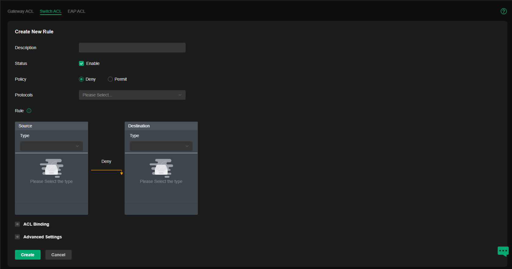
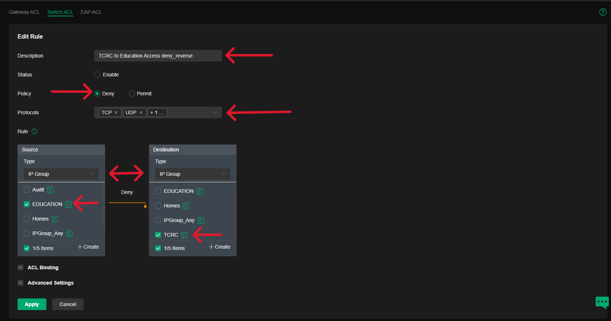

# **Access Control List (ACL) Planning and Configuration Guide**  

## **Overview**  
Access Control Lists (ACLs) are essential for network security, allowing administrators to control traffic flow and restrict unauthorized access between different network segments. This guide will walk you through creating and applying ACL rules using an IP Group approach.

---

## **Step 1: Creating an IP Group**  

Before defining ACL rules, we need to group IP addresses based on departments, user roles, or security needs.  

### **1. Access the Groups Section**  
- Navigate to **Settings** → Under **Basic Profile**, select **Groups**.  

- Click on **Create New Group**. 

### **2. Define the Group Type**  
- Choose **IP Group** (This type is ideal for ACL configuration, as it allows control over traffic between specific subnets or IP ranges).  

### **3. Assign IP Addresses to the Group**  
- Enter the **IP Subnet** or **IP Range** that you want to group.  
- Apply the settings to finalize the group creation.  

📌 **Example Use Case:**  
If you want to block communication between the Finance and HR departments, create separate IP groups for each department by defining their respective subnets or IP ranges.

---

## **Step 2: Creating ACL Rules**  

Once the IP groups are set, we can define ACL rules to enforce network security policies.  

### **1. Navigate to the ACL Settings**  
- Go to **Settings** → Select **ACL** under **Network Security**.  

- Locate the **Switch ACL** section and click **Create New Rule**.  

### **2. Define Rule Parameters**  
Fill in the required fields:  

- **Rule Description**: Provide a meaningful name for the rule (e.g., *Block Inter-Department Ping*).  
- **Status**: Ensure the rule is **Enabled**.  
- **Policy**: Choose **Deny** (this will block unwanted traffic).  
- **Protocols**: Select the protocol(s) to be restricted (e.g., ICMP for blocking ping requests).  

### **3. Define Source and Destination**  
- **Source Type**: Choose **IP Group** and select the appropriate department or user group (e.g., *Finance Department*).  
- **Destination Type**: Choose **IP Group** and select the department or user group to apply the restriction against (e.g., *HR Department*).  

### **4. Apply and Save the Rule**  
- Review the rule settings to ensure accuracy.  
- Click **Apply** to enforce the ACL policy.  

📌 **Example Scenario:**  
If the **Finance Department** (192.168.1.0/24) should not communicate with the **HR Department** (192.168.2.0/24), create an ACL rule that:  
- **Source:** Finance IP Group (192.168.1.0/24)  
- **Destination:** HR IP Group (192.168.2.0/24)  
- **Policy:** Deny  
- **Protocol:** ICMP (to block ping requests)  

---

## **Final Thoughts**  
Implementing ACLs effectively helps secure network resources by controlling communication between devices, departments, and services. Regularly review and update ACL rules to maintain security and accommodate any changes in your network structure.  

