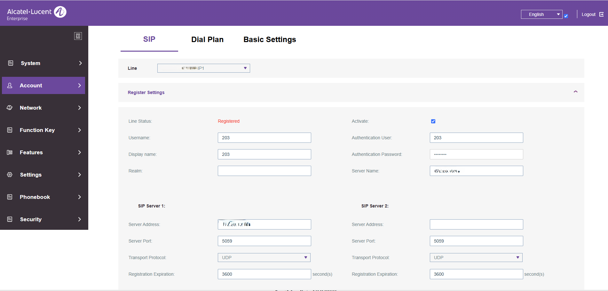

# IP Phone Configuration Guide

## Objective

This document explains how to configure an IP phone using a DHCP-assigned IP address and register it with the Alcatel OXO Connect IP PBX.

---

## Prerequisites

- IP phone connected to the network
- DHCP server available
- Access to the Alcatel OMC application
- SIP extension details
- Default IP phone credentials

---

## Step 1 - Verify DHCP IP Assignment

1. Connect the IP phone to the network.
2. Verify that the phone receives an IP address from the DHCP server.
3. Note the assigned IP address.

---

## Step 2 - Access the Web Interface

1. Open a web browser.
2. Browse to:

   ```
   http://<DHCP-IP-Address>


3. Log in using the default credentials.

| Setting | Value |
|----------|-------|
| Username | `admin` |
| Password | `123456` |


## Step 3 - Configure Network Settings

Since DHCP is used in this environment, no static IP configuration is required.

- Ensure **DHCP** is enabled.
- Skip any Static IP configuration.
- Continue to the SIP account configuration.


## Step 4 - Configure the SIP Account

Navigate to:

**Account Settings**

Configure the following values.

| Parameter | Value |
|-----------|-------|
| SIP Server IP | PBX IP Address |
| Extension Number | Assigned Extension |
| Server Port | SIP Port |
| Authentication Password | SIP Password from Alcatel OMC |


Click **Save** after entering all values.


---

## Step 5 - Obtain the SIP Password

1. Log in to **Alcatel OMC**.
2. Navigate to:


Subscribers / Base Stations

 Subscribers List

 

3. Locate the required extension.
4. Double-click the extension.
5. Open **IP/SIP**.
6. Open **SIP Parameters**.
7. Copy the **SIP Password**.
8. Return to the IP phone configuration page.
9. Paste the password into **Authentication Password**.

---

## Step 6 - Verify Registration

Save the configuration.

Verify that the SIP account status displays:


Registered



```

If the account is not registered, verify:

- SIP Server IP
- Extension Number
- Server Port
- SIP Password
- Network connectivity


## Step 7 - Test the Phone

Perform the following tests.

- Make an internal call.
- Receive an internal call.
- Verify two-way audio.
- Confirm successful call connection.


## Expected Result

The IP phone should successfully register with the Alcatel OXO Connect PBX, and the extension should be able to make and receive calls.