# How to Configure the Omada L3 Switch and Adopt it on Omada Controller

### 1. Connect the Cambium Router to the PoE Adapter
Follow these steps to power up the Cambium device using a PoE adapter:
- Connect an Ethernet cable from the **Ethernet port** of the Cambium device to the **PoE port** of the **Gigabit Data+ Power** adapter.
- Connect another Ethernet cable from the **Ethernet port** on your computer to the **Gigabit Data port** on the PoE adapter.

 

---

### 2. Assign an IP Address to Your Computer
Assign a static IP address in the range of `192.168.0.x` (for example, `192.168.0.10`) to your computer's network interface. This is necessary to access the Omada L3 switch interface.

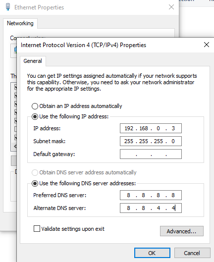

---

### 3. Access the Cambium Device Web Interface
Open a web browser and enter the Cambium device’s default IP address: `http://192.168.0.1`.

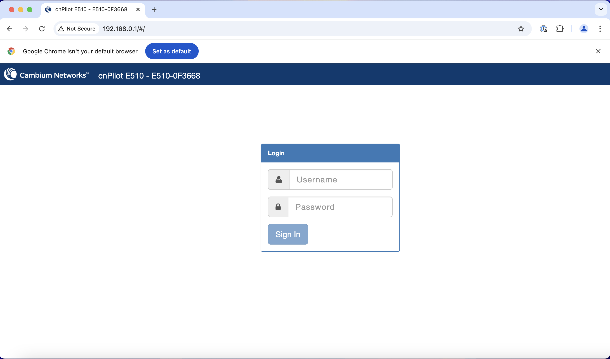

---

### 4. Log in to the Cambium Device
The login page will appear. Log in with the default credentials:
- **Username**: `admin`
- **Password**: `admin`

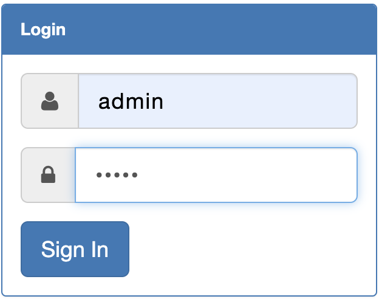
---

### 5. Set Up the Configuration
Once logged in, 

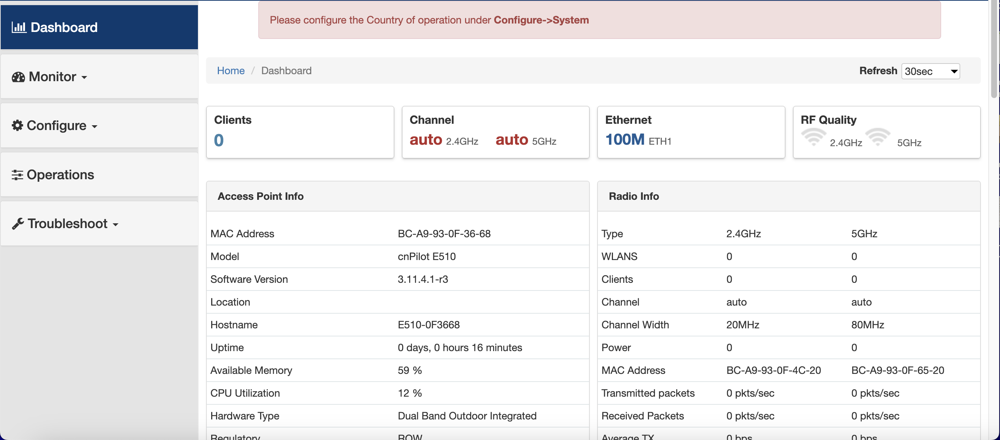

navigate to the **System** settings:
- Set the **Country Code** to “India.”
- Fill out the required fields and apply the changes.

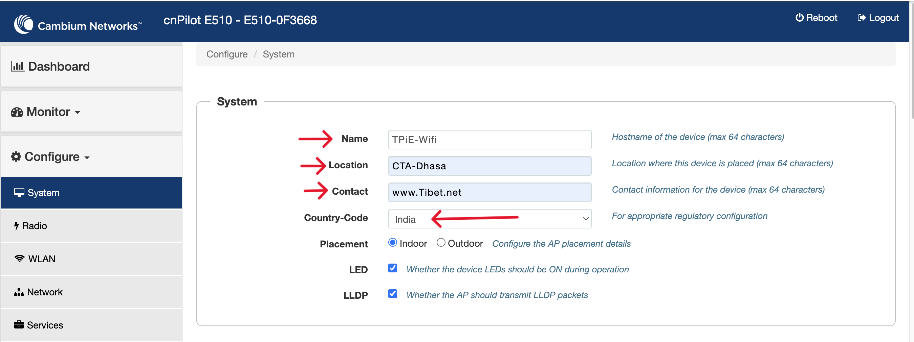

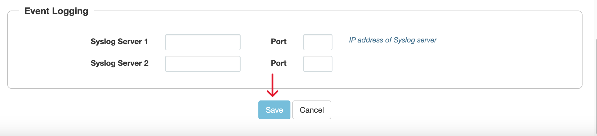

---

### 6. Configure Radio Settings
Ensure that both **2.4 GHz** and **5 GHz** radios are enabled for optimal wireless performance.

---

### 7. Configure WLAN Settings
- Click on the **Add WLAN** button to create a new WLAN.
- Choose a **WLAN ID** and click **OK**.

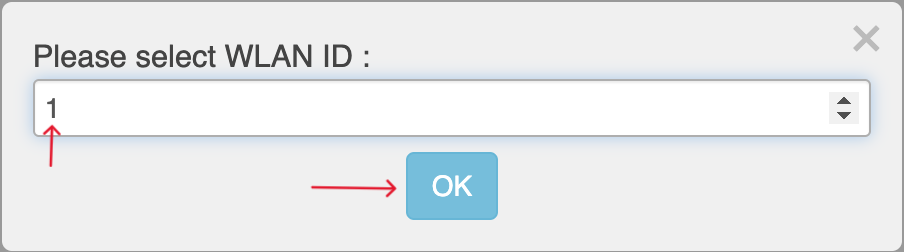

---

### 8. Configure Basic WLAN Settings
In the **Basic Settings** section:
- Provide an SSID for the WLAN.
- Add a **VLAN ID** if applicable.
- Set the **Security** option to **Open**.
- Select the radio types (2.4 GHz and/or 5 GHz) on which this WLAN should operate.

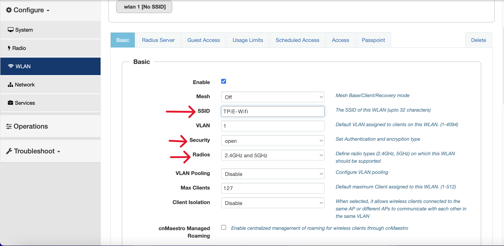

- Save the configuration.

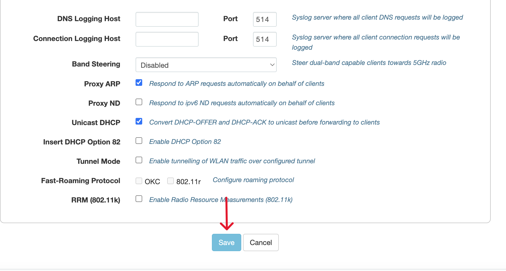

---

### 9. Set Up Network Settings
In the **Network Settings** section:
- Select **Static IP** for the bridge IP configuration.
- Assign a **static IPv4 address** to the interface according to your network plan.

Click **Save** to save the changes.

---

### 11. Connect the Cambium Router to the Omada Switch
Use an Ethernet cable to connect the **Cambium router** to the **Omada Switch**.

---

### 12. Log in to cnMaestro
Log in to your **Cn Maestro cloud account** (cnMaestro) using the provided credentials.

---

### 13. Navigate to Device Onboarding
Go to the **Onboard** section within cnMaestro and click on **Claim Device**.

---

### 14. Claim the Cambium Router
In the **Claim Device** dialog, enter the **serial number** of the Cambium device you wish to onboard, then proceed with claiming the device.

---

### 15. Verify Successful Connection
Once the device is successfully onboarded, it will appear as **Online** in cnMaestro, and you will be able to monitor and manage the Cambium router from the Omada Controller.

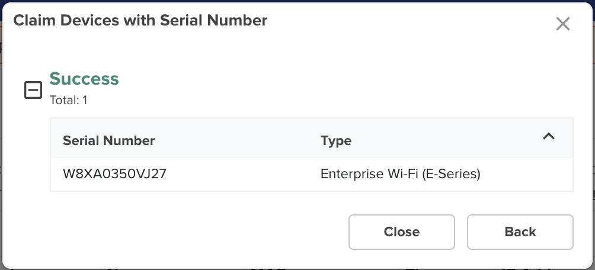

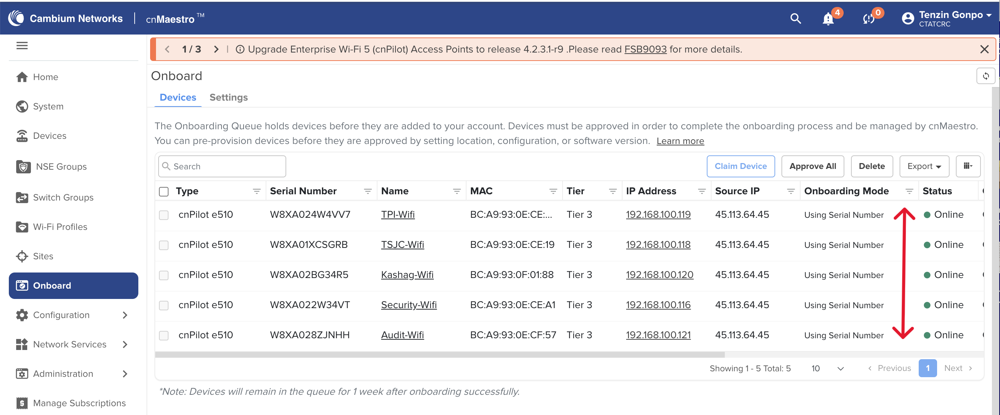
---
