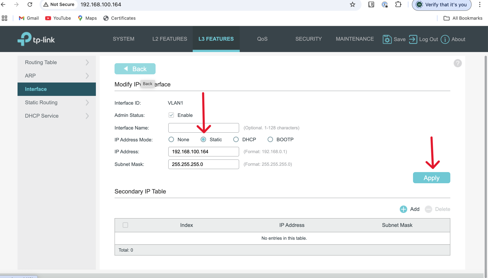

# How to Configure Omada L3 Switch and Adopt on Omada Controller

1. **Assign IP Address**  
   Assign an IP address in the range of `192.168.0.1` to your computer's network interface to access the Omada L3 switch.

   

2. **Access the Switch**  
   Open a browser and enter the switch IP address: `http://192.168.0.1`.

   

3. **Login**  
   The login page will appear. Log in with the default credentials:
   - Username: `admin`
   - Password: `admin`

    

4. **Change Default Password**  
   Change the default password to a new, secure password of your choice.

   

5. **Navigate to L3 Settings**  
   Go to the **L3** feature, located at the top of the home page.

   

6. **Interface Settings**  
   From the left menu, go to **Interface Settings** and select **IPv4** for further configuration.

    

7. **Assign Static IP**  
   Assign a static IPv4 address to the switch, as planned, by selecting **Static IP**.

    

8. **Save Configuration**  
   Apply and save the configuration changes.

    

9. **Connect to Omada-Core-Switch**  
   Connect the L3 switch to your **Omada-Core-Switch**, which should already be connected to the Omada Controller.

10. **Login to Omada Controller**  
    Log in to the Omada Controller.

11. **Check Device List**  
    In the device list, you will see the new device trying to connect to your network.

     

12. **Adopt the Switch**  
    Adopt the correct switch by clicking **Adopt**. You may need to click **Adopt** twice to ensure it is adopted on the second attempt. On the second attempt, you will be prompted to enter the login credentials of the remote switch.

     

13. **Successful Connection**  
    After entering the credentials, the Omada L3 switch will be successfully connected to the network and controlled by the Omada Controller.

     

14. **Rename Switch**  
    Change the switch name as desired and apply the changes.

     
      

15. **Configure Remote Switch**  
    Now, you can access and configure the remote Omada L3 switch through the Omada Controller.

     
