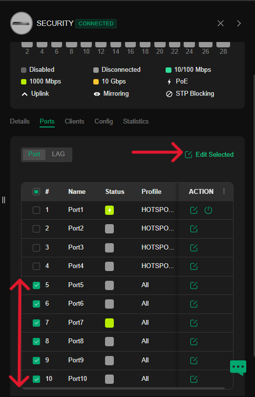

# Omada Controller and Network Configuration Guide

Follow these steps to configure the Omada Controller, Core Switch, and Firewall-Router for network setup:

## 1. Log in to the Omada Controller
Open your browser and log in using the IP address of your Omada controller.
- Username: `admin`
- Password: `*****`

Once logged in, navigate to the **Your site** section in the dashboard.

## 2. Select "Devices" and Choose the Core Switch
In the **Devices** tab, locate and select the **Core Switch** you want to configure.

## 3. Go to "Config" and Open "VLAN Interfaces"
In the Core Switch settings, click on the **Config** tab, then select **VLAN Interfaces**.
Choose the department you’re working on, and click **Edit** to modify the settings.

## 4. Assign Static IP and Enable DHCP
Set a **static IP address** for the local network and provide the subnet mask. Then, enable the **DHCP Server**.
Define the **DHCP range** and specify the DNS settings as required.

## 5. Apply the Changes
After configuring the IP and DHCP settings, click **Apply** to save the changes.

## 6. Return to "Devices" and Select the L3 Switch
Go back to the **Devices** tab and select the **L3 Switch** for the department you are configuring.

## 7. Enable VLAN Profiles
Go to the **Configure** section, then open **VLAN** settings. Enable the following profiles: and apply changes
- **Default**
- **Hotspot**
- **[Department Name Profile]**

## 8. Configure Switch Ports
Go to the **Port** section, select the desired port, and click **Edit Selection**. Assign the correct profile to the remaining ports as needed.

## 9. Apply Port Configurations
After configuring the ports, click **Apply** to save the changes.

## 10. Computer Receives DHCP IP (No Internet)
Your connected computer will now receive an IP from the switch via DHCP but won’t have internet access yet.

## 11. Configure Routing on the Firewall Server
To enable internet access, you must configure routing on your **Firewall Server** to route traffic from the switch to the internet.

## 12. Using RB 450G as the Firewall Router
For this setup, we’re using the **RB 450G** as the **Sophos Firewall Router**, which acts as the firewall server.

## 13. Log in to RB 450G via Winbox
Open **Winbox** and log in to the **RB 450G** router.

## 14. Navigate to Routes in Winbox
Go to **IP** > **Routes** in the Winbox menu.

## 15. Add a Routing Entry
Click the **Add** button in the top-left corner. Enter the **destination IP** and the gateway for routing traffic to the network. Then, click **Apply** and  **save**.

## 16. Internet Access Available
After the route is added, you will now have internet access from your network through the configured switch and firewall.

