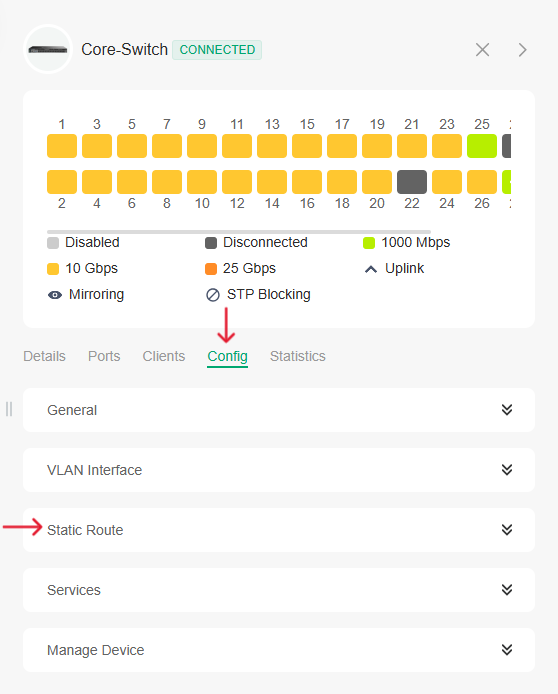

#  How to Add a Static Route in TP-Link Omada Core Switch

##  1. Access the Omada Controller
- Open your browser and go to: `https://aps1-omada-cloud.tplinkcloud.com/#orgManager`
- Log in with your **admin credentials**

##  2. Go to the Target Site
- From the **Global View**, select the **Site** where the switch is deployed.

##  3. Open Device Settings
- Navigate to **Devices**
- Click on the core switch (e.g., `TL-SG3452XP`)
- Click the **config (Settings)** to open the switch settings panel

##  4. Add Static Route
### Step-by-Step:
1. In the settings panel, go to the **Static Route** tab.
2. click **Add**.

3. Fill in the required fields:

   - **Destination IP**: The network you want to reach (e.g., `0.0.0.0\0`)
   - **Subnet Mask**: The subnet mask for the destination (e.g., `255.255.255.0`)
   - **Next Hop**: The IP address of the next hop router (e.g., `172.28.0.1`)

   

4. Click **Apply** or **Save**