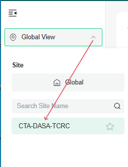
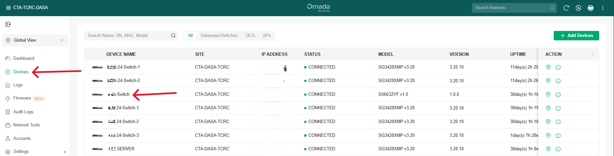
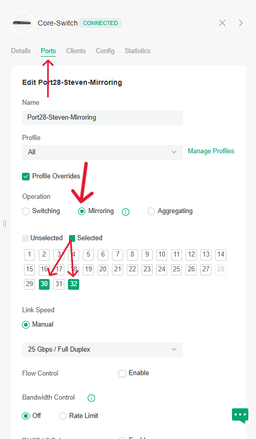

# TP-Link Omada Core Switch: Port Mirroring Setup Guide

##  1. Accessing the Omada Controller

### Step 1: Log in to Omada Controller
- Open a browser and enter the address of your **Omada Controller** (e.g., `https://aps1-omada-cloud.tplinkcloud.com/`)
- Enter your **admin credentials**

### Step 2: Navigate to the Site
- In the **Global View**, select the **Site** where your switch is located.

##  2. Navigate to the Switch in the Site

### Step 3: Go to Devices
- In the left sidebar, click **Devices**
- Locate and click on your **TP-Link Core Switch** (e.g., `TL-SG3452XP`)

##  3. Configure Port Mirroring on the Switch

### Step 4: Open Port Settings
- In the device detail panel, click on the **gear icon (Settings)**.
- Go to the **Ports** tab.

### Step 5: Set Up Port Mirroring

1. **Select a port to mirror from** (this is your **source port**—the port you want to monitor).

2. Click the **Edit (pencil) icon** next to that port.
3. In the configuration dialog:
   - Enable **Port Mirroring**
   - Specify the **destination port** (monitor port—connected to a sniffer like Wireshark)

   

#### Example:

| Source Port | Mirroring Direction | Destination Port |
|-------------|---------------------|------------------|
| Port 28     | Both                | Port 30 & 32        |

>  You can have multiple source ports but usually just **one destination port**.

---

##  4. Apply and Save

### Step 6: Save Configuration
- Click **Apply**
- Confirm and allow the switch to update its config

---
Notes:

     - `Ingress`: Capture incoming traffic only
     - `Egress`: Capture outgoing traffic only
     - `Both`: Capture all traffic

##  Why Use Port Mirroring?

###  Purpose:
Port mirroring allows administrators to **send a copy of network packets** seen on one (or multiple) ports to another port, where a **network analyzer** (like Wireshark) can capture and inspect the traffic.

###  It Helps With:
- **Network troubleshooting** (e.g., identifying packet loss or latency)
- **Security analysis** (monitor for suspicious behavior or intrusions)
- **Performance monitoring**
- **VoIP quality analysis**
- **Compliance auditing**
